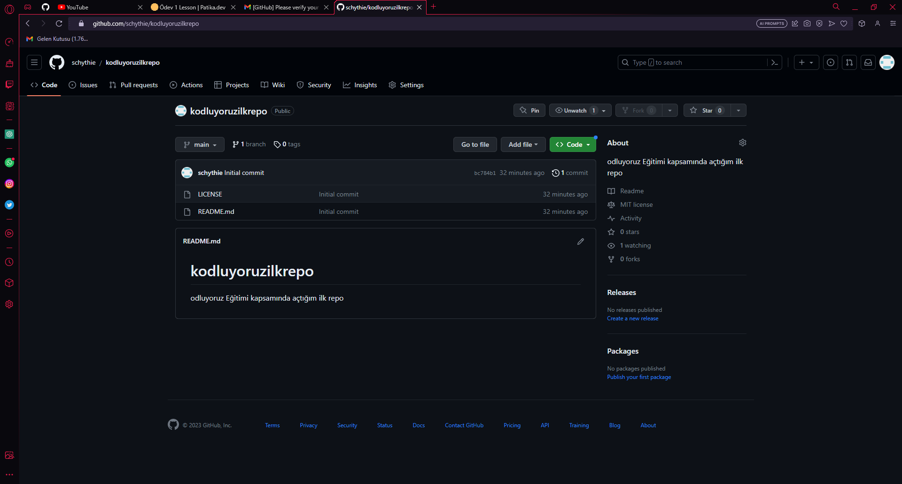

# Kodluyoruz İlk Repo
Bu repo Kodluyoruz Front End Eğitiminde oluşturduğumuz ilk repo. İçerisinde bir adet README dosyası, bir adet de index.html barındırıyor.



# Installlation

Öncelikle projeyi clonelayın. https://github.com/schythie/kodluyoruzilkrepo.git

```
git clone https://github.com/schythie/kodluyoruzilkrepo.git
```

# Usage
Projeyi cloneladıktan sonra Visual Studio Code programında açınız. Linux için:

```
cd kodluyoruzilkrepo
code .
```

# Contributing
Pull requestler kabul edilir. Büyük değişiklikler içni, lütfen önce neyi değiştirmek istediğinizi tartışmak için bir konu açınız.

# License
[MIT License](https://opensource.org/licenses/MIT)


